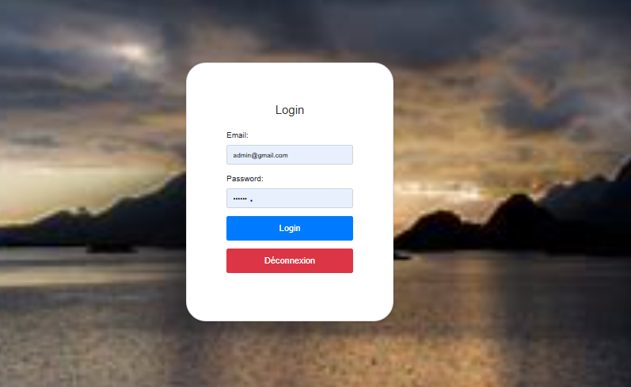

# Mini CRM for SMEs



A mini Customer Relationship Management (CRM) system designed for small and medium enterprises (SMEs) to streamline lead management, appointment scheduling, and team collaboration. Developed as a final-year project by students at EMSI (École Marocaine des Sciences de l'Ingénieur).

---

## Features ✨

- **Lead Management**  
  - Add, edit, and filter leads with details like name, contact info, status, and assigned team member.
  - Export/import leads via CSV/Excel.
- **Appointment Scheduling**  
  - Interactive calendar for creating, modifying, and tracking appointments.
  - Real-time updates and history logging.
- **User Authentication**  
  - Secure login for admins and team members using Firebase Authentication.
- **Team Collaboration**  
  - Admins can create team members and assign leads.
  - Real-time notifications for updates.
- **Statistics Dashboard**  
  - Visualize lead distribution by status (pending, confirmed, canceled).

---

## Technologies Used 🛠️

- **Frontend**: HTML5, CSS3, JavaScript, Bootstrap 5
- **Backend & Database**: Firebase (Firestore, Authentication, Realtime Database, Hosting)
- **Tools**: Visual Studio Code

---

## Installation 📥

1. **Clone the repository**:
   ```bash
   git clone https://github.com/your-username/mini-crm.git
   cd mini-crm

   ...

## Screenshots 📸
|  Admin Profile          | Members Profile                | Notifications Profile      |
|--------------------------|------------------------------|-----------------------------|
|  |  |  |

## Contributors 👥
- **Salaheddine AIT EL MAHJOUB**  
  [](https://github.com/saitelmahjoub)

**Supervisor**: Mohamed ATIBI  
**Partners**: [WEBRASMA](https://webrasma.com/) & [Rankin DIGITAL](https://rankindigital.com/)

## License 📄
[](https://opensource.org/licenses/MIT)  
See [LICENSE](LICENSE) for details.

## Acknowledgments 🙏
- EMSI for academic support.
- Sofia Lemssaddak for project guidance.
- Firebase and Bootstrap teams for open-source tools.
